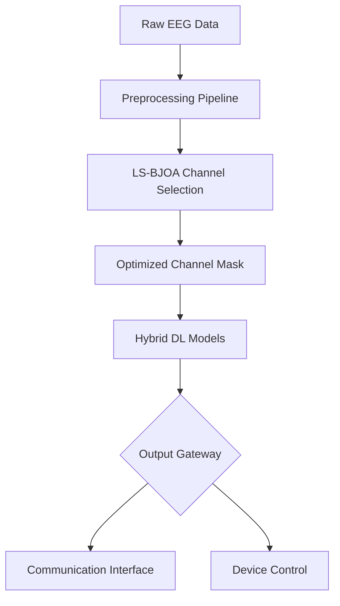

# EEG-Based Multimodal Assistive System for ALS Patients

[](https://www.python.org/)
[](https://pytorch.org/)
[](LICENSE)

An AI-driven Brain-Computer Interface (BCI) system designed to restore communication and control for patients with Amyotrophic Lateral Sclerosis (ALS). This project utilizes non-invasive EEG signals, optimized through a custom **LS-BJOA** channel selection algorithm, to classify motor imagery with state-of-the-art Deep Learning models.

---

## 📌 Project Overview

Patients with ALS often lose the ability to communicate or interact with their environment due to motor neuron degeneration. This multimodal BCI system provides two primary pathways for assistance:
1.  **Imagined Speech Classification:** Translating neural patterns into communication output.
2.  **Motor Imagery Classification:** Translating imagined movements into control signals for external devices (e.g., wheelchairs, robotic arms).

By combining advanced signal optimization with hybrid neural networks, this system achieves high classification accuracy while reducing the computational overhead of high-density EEG caps.

---

## ✨ Key Features

*   **Multimodal Output:** Supports both text-based communication and device control.
*   **Intelligent Channel Selection:** Integrated **LS-BJOA** algorithm to identify the most discriminative EEG electrodes.
*   **Hybrid Deep Learning:** Implementation of 6 distinct architectures including spatial-temporal hybrids (CNN+LSTM).
*   **Cross-Dataset Support:** Unified pipeline for BCI Competition III and IV datasets.
*   **Dynamic Adaptation:** Automatically handles binary and multi-class classification tasks.

---

## 🏗 System Architecture



---

## 📊 Dataset Information

The project evaluates performance across three benchmark BCI datasets:

| Dataset | Type | Classes | Channels | Description |
| :--- | :--- | :--- | :--- | :--- |
| **BCI IV-2a** | Multi-class | 4 (L/R Hand, Feet, Tongue) | 22 | Standard motor imagery benchmark. |
| **BCI IV-1** | Binary | 2 (Motor Imagery) | 59 | Binary MI dataset for robustness testing. |
| **BCI III-IVa** | Binary | 2 (MI vs Baseline) | 118 | High-density EEG for optimization testing. |

> **Note:** Each dataset is preprocessed independently to account for varying sampling rates and electrode configurations.

---

## ⚙️ Preprocessing Pipeline

All EEG signals undergo a rigorous 4-step preprocessing workflow:
1.  **Bandpass Filtering:** 4–40 Hz to isolate relevant $\mu$ and $\beta$ rhythms.
2.  **ICA Artifact Removal:** Independent Component Analysis to eliminate EOG/EMG noise.
3.  **Segmentation:** Trial epoching and windowing based on dataset-specific onset markers.
4.  **Normalization:** Z-score standardization across trials to ensure model stability.

---

## 🧬 LS-BJOA Channel Selection

To improve efficiency, we implement the **Logistic S-shaped Binary Jaya Optimization Algorithm (LS-BJOA)**.

*   **Objective:** Reduce the 118-channel input space to a minimal subset of high-impact electrodes.
*   **Mechanism:** Uses a chaotic logistic map to prevent local optima and an S-shaped transfer function for binary masking.
*   **Fitness Function:** A multi-objective function:
    $$Fitness = w_1 \cdot F1_{score} + w_2 \cdot (1 - \frac{Selected\_Channels}{Total\_Channels})$$

---

## 🧠 Deep Learning Models

We implemented and compared six architectures to find the optimal balance of speed and accuracy:

1.  **EEGNet:** A compact convolutional network specifically for EEG.
2.  **CNN (1D):** Extracts spatial features across the channel dimension.
3.  **RNN:** Captures basic temporal dependencies in the signal.
4.  **LSTM:** Addresses the vanishing gradient problem in long EEG sequences.
5.  **CNN + RNN:** Hybrid architecture for spatial-temporal extraction.
6.  **CNN + LSTM:** Our **primary hybrid architecture**, utilizing CNN for feature extraction and LSTM for sequential modeling.

---

## 📈 Evaluation Metrics

| Task Type | Primary Metrics | Visualization |
| :--- | :--- | :--- |
| **Binary** | Accuracy, Precision, Recall, F1, ROC-AUC | Loss Curves, ROC Curves |
| **Multi-class** | Accuracy, F1-Macro | Confusion Matrices |

---

## 🏁 Current Project Status

✅ **Dataset Preprocessing:** All benchmark datasets processed and normalized.  
✅ **Model Suite:** All 6 DL models (EEGNet to CNN+LSTM) fully implemented.  
✅ **Optimization Integration:** LS-BJOA module integrated with PyTorch pipeline.  
✅ **Evaluation:** 5-Fold Cross-Validation with early stopping implemented.  
✅ **Automation:** `run_experiment_with_cs.py` automates Full vs. CS comparisons.  
⏳ **Experimentation:** Final large-scale training runs are currently in progress.

---

## 📂 Folder Structure

```text
├── channel_selection/    # LS-BJOA Optimizer & Fitness Logic
├── models/               # PyTorch Model Architectures
├── pipeline/             # Training, Eval, and Utils
├── processed_data/       # Preprocessed .npy datasets
├── visualization/        # Topomaps and Fitness Curves
├── results/              # CSV reports and saved weights
└── run_experiment_with_cs.py # Main Entry Point
```

---

## 🚀 Installation & Usage

### Prerequisites
* Python 3.8+
* CUDA-capable GPU (recommended)

### Setup
1.  Clone the repository:
    ```bash
    git clone https://github.com/KunalGupta28/Capstone_EEG.git
    cd Capstone_EEG
    ```
2.  Install dependencies:
    ```bash
    pip install -r requirements.txt
    ```

### Running Experiments
To run the automated pipeline (Full channels vs. Optimized channels):
```bash
python run_experiment_with_cs.py
```

---

## 🔮 Future Work

*   **Real-time Streaming:** Integration with LSL for live EEG classification.
*   **Hardware Integration:** Connecting classification output to a robotic arm.
*   **Imagined Speech Decoding:** Expanding the multimodal aspect to include silent speech.
*   **Online Learning:** Implementing adaptive BCI that updates as the patient's signals change.

---

## 📄 License
This project is licensed under the MIT License - see the [LICENSE](LICENSE) file for details.

---

**Developed for the University Capstone Project.**  
*Contributors: [Kunal Gupta]*
