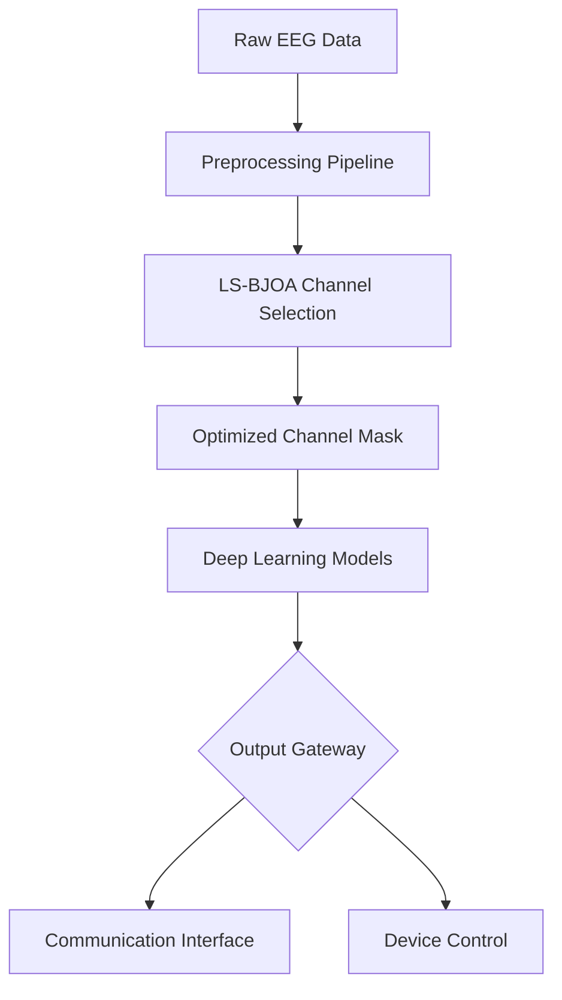

# EEG-Based Multimodal Assistive System for ALS Patients

[](https://www.python.org/)
[](https://pytorch.org/)
[](LICENSE)

An AI-driven Brain-Computer Interface (BCI) system designed to restore communication and control for patients with Amyotrophic Lateral Sclerosis (ALS). This project utilizes non-invasive EEG signals, optimized through a custom **LS-BJOA** channel selection algorithm, to classify motor imagery using state-of-the-art Deep Learning models.

---

## 📌 Project Overview

Patients with ALS often lose the ability to communicate or interact with their environment due to motor neuron degeneration. This multimodal BCI system provides two primary pathways for assistance:
1.  **Imagined Speech Classification:** Translating neural patterns into communication output.
2.  **Motor Imagery Classification:** Translating imagined movements into control signals for external devices (e.g., wheelchairs, robotic arms).

By combining advanced signal optimization with hybrid and graph-based neural networks, this system achieves high classification accuracy while reducing the computational overhead of high-density EEG caps.

---

## ✨ Key Features

*   **Multimodal Output:** Supports both text-based communication and device control.
*   **Intelligent Channel Selection:** Integrated **LS-BJOA** algorithm to dynamically identify the most discriminative EEG electrodes.
*   **Cutting-Edge Deep Learning:** Implementation of 7 distinct architectures including Convolutional Transformers (Conformer) and Spatial-Temporal Graph Convolutional Networks (ST-GCN).
*   **Robust Evaluation:** Generates paper-ready summary tables including advanced BCI metrics like Cohen's Kappa ($\kappa$) and Channel Reduction Rate (CRR).
*   **Cross-Dataset Support:** Unified pipeline for BCI Competition III and IV datasets handling both binary and multi-class tasks automatically.

---

## 🏗 System Architecture


```mermaid
graph TD
    A[Raw EEG Data] --> B[Preprocessing Pipeline]
    B --> C[LS-BJOA Channel Selection]
    C --> D[Optimized Channel Mask]
    D --> E[Deep Learning Models]
    E --> F{Output Gateway}
    F --> G[Communication Interface]
    F --> H[Device Control]
```

---

## 📊 Dataset Information

The project evaluates performance across three benchmark BCI datasets:

| Dataset | Type | Classes | Channels | Description |
| :--- | :--- | :--- | :--- | :--- |
| **BCI IV-2a** | Multi-class | 4 (L/R Hand, Feet, Tongue) | 22 | Standard motor imagery benchmark. |
| **BCI IV-1** | Binary | 2 (Motor Imagery) | 59 | Binary MI dataset for robustness testing. |
| **BCI III-IVa** | Binary | 2 (MI vs Baseline) | 118 | High-density EEG for optimization testing. |

> **Note:** Each dataset is preprocessed independently to account for varying sampling rates and electrode configurations.

---

## ⚙️ Preprocessing Pipeline

All EEG signals undergo a rigorous 4-step preprocessing workflow:
1.  **Bandpass Filtering:** 4–40 Hz to isolate relevant $\mu$ and $\beta$ rhythms.
2.  **ICA Artifact Removal:** Independent Component Analysis to eliminate EOG/EMG noise.
3.  **Segmentation:** Trial epoching and windowing based on dataset-specific onset markers.
4.  **Normalization:** Z-score standardization across trials to ensure model stability.

---

## 🧬 LS-BJOA Channel Selection

To improve efficiency, we implement the **Logistic S-shaped Binary Jaya Optimization Algorithm (LS-BJOA)**.

*   **Objective:** Reduce the 118-channel input space to a minimal subset of high-impact electrodes.
*   **Mechanism:** Uses a chaotic logistic map to prevent local optima and an S-shaped transfer function for binary masking.
*   **Fitness Function:** A multi-objective function powered by bandpower features:
    $$Fitness = 0.7 \cdot F1_{macro} + 0.2 \cdot Acc + 0.1 \cdot CRR$$

---

## 🧠 Deep Learning Models

We implemented and compared 7 state-of-the-art architectures to find the optimal balance of speed and accuracy:

1.  **EEGNet:** A compact, highly efficient convolutional network specifically for EEG.
2.  **CNN (ShallowConvNet):** Extracts spatial features across the channel dimension.
3.  **LSTM:** Addresses the vanishing gradient problem in long EEG sequences.
4.  **CNN + LSTM:** A hybrid architecture utilizing CNN for spatial feature extraction and LSTM for sequential modeling.
5.  **DeepConvNet:** A deep hierarchical convolutional network for complex feature extraction.
6.  **EEG Conformer:** A Convolutional Transformer utilizing Self-Attention to capture global dependencies.
7.  **GraphNet (ST-GCN):** A Spatial-Temporal Graph Convolutional Network that learns a dynamic symmetric adjacency matrix to model brain functional connectivity.

---

## 📈 Evaluation Metrics

The pipeline automatically generates side-by-side comparisons of Full vs. Selected channels across all datasets, outputting the following metrics:

*   **Accuracy (%)**
*   **F1-Score (Macro)**
*   **Cohen's Kappa ($\kappa$)** (Chance-corrected agreement)
*   **ROC-AUC** (Macro One-vs-Rest for multiclass)
*   **Channel Reduction Rate (CRR)**
*   **Training Time**

---

## 🏁 Current Project Status

✅ **Dataset Preprocessing:** All benchmark datasets processed and normalized.  
✅ **Model Suite:** All 7 DL models fully implemented and verified.  
✅ **Optimization Integration:** LS-BJOA module integrated with dynamic graph networks.  
✅ **Evaluation Pipeline:** Robust cross-validation, class-weighted loss, and paper-ready CSV generation.  
⏳ **Experimentation:** Final large-scale training runs are ready to execute.

---

## 📂 Folder Structure

```text
├── channel_selection/    # LS-BJOA Optimizer & Fitness Logic
├── models/               # PyTorch Model Architectures (GCN, Conformer, etc.)
├── pipeline/             # Training loops, Eval metrics, and Utils
├── processed_data/       # Preprocessed .npy datasets
├── scratch/              # Integration and smoke tests
├── visualization/        # Topomaps and Fitness Curves
├── results/              # CSV reports and saved weights
└── run_experiment_with_cs.py # Main Entry Point
```

---

## 🚀 Installation & Usage

### Prerequisites
* Python 3.8+
* CUDA-capable GPU (highly recommended)

### Setup
1.  Clone the repository:
    ```bash
    git clone https://github.com/KunalGupta28/Capstone_EEG.git
    cd Capstone_EEG
    ```
2.  Install dependencies:
    ```bash
    pip install -r requirements.txt
    ```

### Running Experiments
To run the automated pipeline (Full channels vs. Optimized channels) and generate paper-style CSV tables:
```bash
python run_experiment_with_cs.py
```

---

## 🔮 Future Work

*   **Real-time Streaming:** Integration with LSL for live EEG classification.
*   **Hardware Integration:** Connecting classification output to a robotic arm.
*   **Online Learning:** Implementing adaptive BCI that updates as the patient's signals change.

---

## 📄 License
This project is licensed under the MIT License - see the [LICENSE](LICENSE) file for details.

---

**Developed for the University Capstone Project.**  
*Contributors: [Kunal Gupta]*

